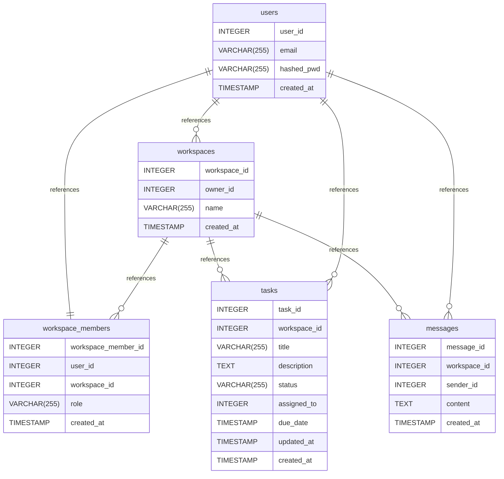

# Untitled Diagram documentation
## Summary

- [Introduction](#introduction)
- [Database Type](#database-type)
- [Table Structure](#table-structure)
	- [users](#users)
	- [workspaces](#workspaces)
	- [workspace_members](#workspace_members)
	- [tasks](#tasks)
	- [messages](#messages)
- [Relationships](#relationships)
- [Database Diagram](#database-diagram)

## Introduction

## Database type

- **Database system:** PostgreSQL
## Table structure

### users

| Name           | Type         | Settings                       | References                                                                        | Note |
| -------------- | ------------ | ------------------------------ | --------------------------------------------------------------------------------- | ---- |
| **user_id**    | INTEGER      | 🔑 PK, not null, autoincrement | fk_User_user_id_Workspace, fk_User_user_id_Workspace_member, fk_User_user_id_Task |      |
| **email**      | VARCHAR(255) | not null                       |                                                                                   |      |
| **hashed_pwd** | VARCHAR(255) | not null                       |                                                                                   |      |
| **created_at** | TIMESTAMP    | not null                       |                                                                                   |      | 

### workspaces

| Name             | Type         | Settings                       | References                                                                                                    | Note |
| ---------------- | ------------ | ------------------------------ | ------------------------------------------------------------------------------------------------------------- | ---- |
| **workspace_id** | INTEGER      | 🔑 PK, not null, autoincrement | fk_Workspace_workspace_id_Workspace_member, fk_Workspace_workspace_id_Task, fk_Workspace_workspace_id_Message |      |
| **owner_id**     | INTEGER      | not null                       |                                                                                                               |      |
| **name**         | VARCHAR(255) | not null                       |                                                                                                               |      |
| **created_at**   | TIMESTAMP    | not null                       |                                                                                                               |      | 

### workspace_members

| Name                    | Type         | Settings                | References | Note |
| ----------------------- | ------------ | ----------------------- | ---------- | ---- |
| **workspace_member_id** | INTEGER      | 🔑 PK, not null         |            |      |
| **user_id**             | INTEGER      | not null, autoincrement |            |      |
| **workspace_id**        | INTEGER      | not null                |            |      |
| **role**                | VARCHAR(255) | not null                |            |      |
| **created_at**          | TIMESTAMP    | not null                |            |      | 

### tasks

| Name             | Type         | Settings                       | References | Note |
| ---------------- | ------------ | ------------------------------ | ---------- | ---- |
| **task_id**      | INTEGER      | 🔑 PK, not null, autoincrement |            |      |
| **workspace_id** | INTEGER      | not null                       |            |      |
| **title**        | VARCHAR(255) | not null                       |            |      |
| **description**  | TEXT         | not null                       |            |      |
| **status**       | VARCHAR(255) | not null                       |            |      |
| **assigned_to**  | INTEGER      | not null                       |            |      |
| **due_date**     | TIMESTAMP    | not null                       |            |      |
| **updated_at**   | TIMESTAMP    | not null                       |            |      |
| **created_at**   | TIMESTAMP    | not null                       |            |      | 

### messages

| Name             | Type      | Settings                       | References                | Note |
| ---------------- | --------- | ------------------------------ | ------------------------- | ---- |
| **message_id**   | INTEGER   | 🔑 PK, not null, autoincrement |                           |      |
| **workspace_id** | INTEGER   | not null                       |                           |      |
| **sender_id**    | INTEGER   | not null                       | fk_Message_sender_id_User |      |
| **content**      | TEXT      | not null                       |                           |      |
| **created_at**   | TIMESTAMP | not null                       |                           |      | 

## Relationships

- **users to workspaces**: one_to_many
- **users to workspace_members**: one_to_one
- **workspaces to workspace_members**: one_to_many
- **workspaces to tasks**: one_to_many
- **users to tasks**: one_to_many
- **workspaces to messages**: one_to_many
- **messages to users**: many_to_one

## Database Diagram

